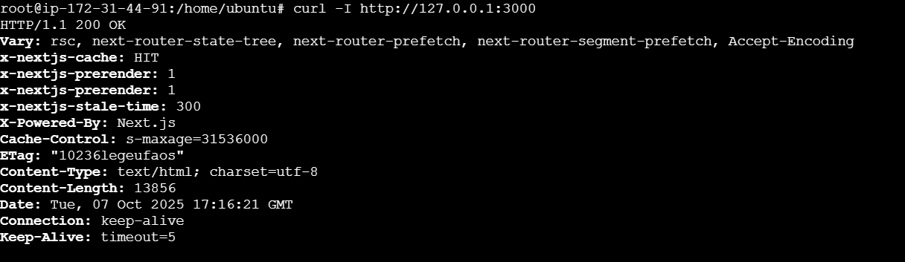
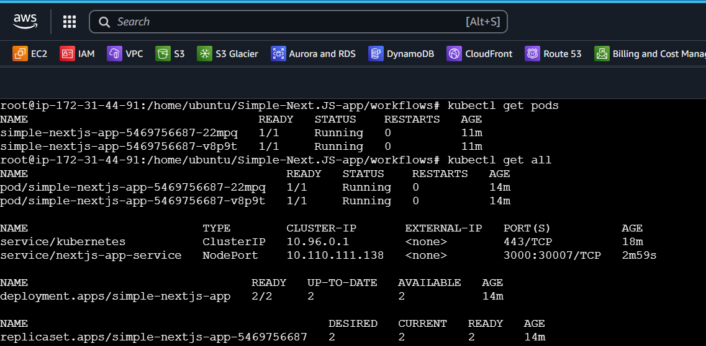
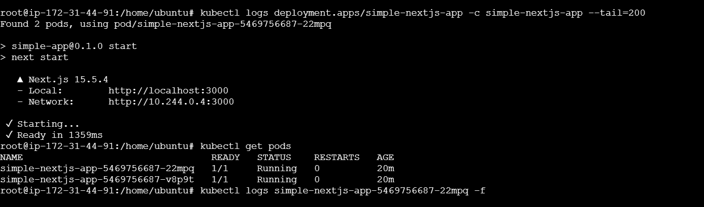

This is a [Next.js](https://nextjs.org) project bootstrapped with [`create-next-app`](https://nextjs.org/docs/app/api-reference/cli/create-next-app).

## Getting Started (at your local)

run the development server:

```bash
npm run dev
```

Open [http://localhost:3000](http://localhost:3000) with your browser to see the result.


# Containerize and Deploy a Next.js Application using Docker, GitHub Actions, and Minikube
- Implement a CI/CD pipeline to automate the deployment of a Next.js application using Docker, GitHub Actions, and Minikube.


## 🛠️ Tech Stack for Application
- **GitHub :** Source code and version control.
- **AWS :** Provisioned AWS EC2 for setup minikube
- **Containerization :** Use Docker for containerizing the application.
- **GitHub Actions :** Create GitHub Actions workflow for CI/CD.

---

## 📝 Setup & Installation

### Prerequisites
- Docker installed on your local machine.
- GitHub account.
- AWS account (for EC2 instance).
- Minikube installed on your local machine or EC2 instance.
- kubectl installed on your local machine or EC2 instance.

### Installation

1. Clone or download this repository
2. Navigate to the project directory:
   ```bash
   cd "Simple-Next.JS-app"
   ```
3. Install dependencies:
   ```bash
   npm run dev
   ```
   Open [http://localhost:3000](http://localhost:3000) with your browser to see the result.


- Below are the steps to containerize and deploy the application.

### Write a Dockerfile to containerize the application using multi-stage builds.

- <b id="Docker">See Dockerfile</b>
<i>[Dockerfile](https://github.com/Vedansh134/Simple-Next.JS-app/blob/main/workflows/Dockerfile)</i>

### Create a GitHub Actions workflow for CI/CD.

- <b id="GitHub-Actions">See GitHub Actions Workflow</b>
<i>[GitHub Actions Workflow](https://github.com/Vedansh134/Simple-Next.JS-app/blob/main/.github/workflows/main.yml)</i>

### Create Kubernetes manifests

- <b id="Kubernetes">See Kubernetes Manifests</b>
<i>[Kubernetes Manifests](https://github.com/Vedansh134/Simple-Next.JS-app/tree/main/kubernetes)</i>

## Deployment steps for Minikube

- Installation of minikube is autmate by shell script in EC2 instance.

- <b id="">See ShellScript for autmoate the installation of minikube</b>
<i>[minikube_install shell-script](https://github.com/Vedansh134/Simple-Next.JS-app/blob/main/shell-scripts/minikube_install.sh)</i>


1. Start Minikube:
   ```bash
   minikube start
   ```
2. Apply the Kubernetes manifests:
   ```bash
    kubectl apply -f kubernetes/deployment.yaml
    kubectl apply -f kubernetes/service.yaml
   ```
3. Verify the deployment:
   ```bash
    kubectl get pods
    kubectl get services
    kubectl get deployments
    kubectl get all
    ```
4. Access the application:
   ```bash
    kubectl port-forward service/nextjs-app-service 3000:3000
   ```
5. To stop Minikube:
   ```bash
    minikube stop
    ```
6. To delete Minikube:
   ```bash
    minikube delete
    ```
---

## How to access the deployed application

Access the application:
   ```bash
    kubectl port-forward service/nextjs-app-service 3000:3000
   ```

Open [http://<your_ec2-instance_ip>:3000](http://<public_ip_of_ec2>:3000) with your browser to see the result.

- application-status


- kubectl get all


- logs and pods



#

## 💰 Approximate Cost (1 Hour Deployment) in ap-south-1 (mumbai region)

|            Service                    | Cost (INR) |    Remarks       |
|---------------------------------------|------------|------------------|
| EC2 Instances (1 x t3.medium)         | ~$0.077    | Per hour cost    |
| EBS volumes (1 x 15GB)                | ~$0.0017   | Per hour cost    |

**Total Estimated Cost:** **~0.0787 INR** per hour
- Note : may be vary and also  exclude data transfer costs and taxes.

#

### 🥲 Challenges faced & how you solved them.
- I take approx 7-8 hours to complete this project.
- I faced issues in github actions workflow because of some syntax error and wrong indentation.
- I faced issues in minikube installation on EC2 instance because of some missing dependencies.

#

## clean up
1. Delete the Kubernetes resources:
   ```bash
    kubectl delete -f kubernetes/deployment.yaml
    kubectl delete -f kubernetes/service.yaml
   ```
2. Stop and delete Minikube:
   ```bash
    minikube stop
    minikube delete
    ```
3. Terminate the EC2 instance from the AWS Management Console to avoid ongoing charges.

